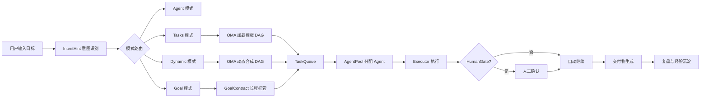
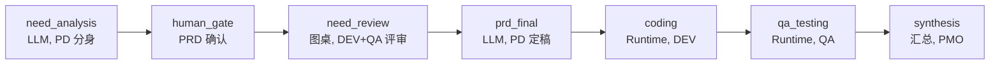
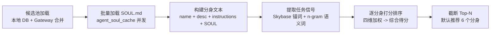
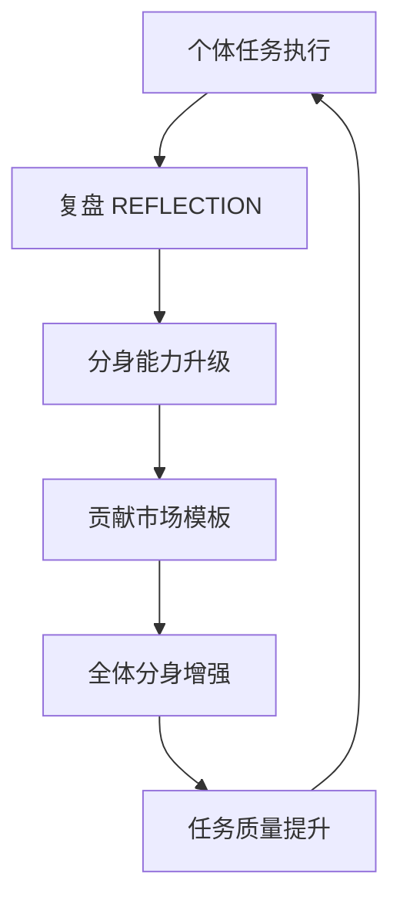

# 小IC工作台项目复现详细文档

> 本文根据 10 张拍屏图片整理，用于复现“小IC工作台”项目。图片存在倾斜、反光和局部模糊，部分细节做了工程化补全与合理推断，复现时应以实际业务规则和接口约束为准。

## 1. 项目定位

### 1.1 一句话定义

小IC工作台是面向消金团队的“数字员工操作系统”。

用户只需要输入一个目标，平台自动进行意图识别、任务拆解、Agent Team 组建、DAG 编排、Runtime 执行、交付验收和经验沉淀，形成从需求到交付的全链路闭环。

### 1.2 面向对象

- PD：产品需求分析、PRD 编写、方案收敛、验收确认。
- 研发：技术方案、编码执行、接口联调、版本交付。
- QA：测试用例、质量评审、回归验证。
- PMO：排期、进度跟踪、复盘总结、跨角色协同。
- 业务/运营：业务目标输入、数据洞察、策略分析、运营活动设计。

### 1.3 核心目标

- 把“问 AI 一个问题”升级为“下达一个目标”。
- 把单次对话升级为可追踪、可编排、可验收的任务链路。
- 把个人 Prompt 经验沉淀为组织级知识、模板和数字员工能力。
- 把多角色协作从人工拉会对齐，升级为 Agent Team 自动交接。

## 2. 背景与问题

### 2.1 传统方式

传统协作中，PD、研发、QA、PMO 各自独立使用 AI 工具，阶段间依靠人工交接文档和会议对齐。

主要问题：

- 信息丢失：需求、约束、上下文在多轮交接中容易遗失。
- 人工拉会：大量时间消耗在同步、确认、排期和追问上。
- 经验不沉淀：优秀 Prompt、业务判断、复盘经验留在个人手里。
- 各自为战：角色之间缺少统一任务上下文和统一交付标准。

### 2.2 小IC方式

小IC工作台通过平台化方式串联协作链路：

- 用户输入目标。
- 平台识别意图和任务模式。
- 系统自动组建 Agent Team。
- OMA 编排引擎生成或加载 DAG。
- Runtime/LLM/Human Gate 混合执行。
- 结果通过模板和标准交付。
- 复盘、Lessons、EVOLUTION、模板升级持续沉淀。

带来的变化：

- 自动传递：Task 产出即下游输入。
- 任务编排：由 DAG 明确依赖、责任和执行顺序。
- 知识注入：Skybase 和 SOUL.md 为 Agent 提供业务上下文。
- 持续进化：复盘与反馈反哺数字员工能力和组织模板。

## 3. 核心价值

### 3.1 对人

每个人拥有自己的 AI 分身实例以及成长档案。

能力包括：

- 个性化数字分身。
- 能力成长追踪。
- 任务经验沉淀。
- 用户反馈进入分身长期记忆。

### 3.2 对组织

Agent 市场统一注册、训练、升级各岗位数字员工。

能力包括：

- 统一管理数字员工。
- 按需分配 Agent。
- 持续升级 Agent 能力。
- 让组织经验从个人脑中迁移到可复用资产中。

### 3.3 对任务

从创建任务到交付验收全链路自动化。

链路包括：

- 创建任务。
- 意图识别。
- 任务编排。
- 角色组队。
- 可观测执行。
- 阶段性交付。
- 验收与复盘。

### 3.4 对基础设施

Server 是数据与编排的唯一真相来源。

基础设施包括：

- Runtime 执行层。
- LLM Gateway。
- API Gateway。
- WebSocket/SSE 实时通道。
- 持久化与搜索。
- 审计、限流、权限、观测。

### 3.5 三个业务价值

#### 零损耗交付

从“问 AI 一个问题”升级为“下达目标”，由 Agent Team 分阶段交付可验收产出。

关键词：

- 目标驱动。
- 分阶段交付。
- 自动上下文传递。
- 减少人工转述损耗。

#### 知识固化

专家经验固化为可 Fork、可进化、可组队调用的数字员工资产。

关键词：

- 可复用。
- 可进化。
- 可组队。
- 可组织化管理。

#### 指数进化

每次任务执行都会进入“复盘 -> 反思 -> 进化 -> 模板升级”的成长飞轮。

关键词：

- 复盘。
- 反馈。
- 进化。
- 模板升级。
- 飞轮效应。

## 4. 系统总览

### 4.1 总体规模

图片中给出的系统规模：

- 4 层架构。
- 8 大能力域。
- 40+ 子模块。
- 49+ 数据表。
- 43+ REST API。
- 5 种执行器。

### 4.2 技术分层

系统按技术分为四层：

```text
接入层 -> Server 层 -> Agent 层 -> Data 层
```

#### 01 接入层

负责用户界面和 API 网关入口。

模块：

- 首页·智能路由：意图识别入口、智能路由分流、Agent 推荐、模式切换。
- 认证与推送：BUC/Mist 认证、JWT 鉴权、消息推送、钉钉通知。
- 任务中心：项目管理、Goal 长程托管、DAG 编排视图、编排模板市场。
- 分身花园：分身创建与配置、子分身挂载、Profile 管理、团队管理。
- Agent 广场：市场模板浏览、一键克隆、评分与发现、技能系统。
- 成长中心：任务复盘、经验提取、代码进化记录、每日成长总结。
- 协同空间：协同房间、群聊消息流、知识库门户、记忆管理。
- API 路由网关：FastAPI 路由、SSE 事件流、MCP 服务端、WebSocket。

#### 02 Server 层

负责核心业务引擎。

模块：

- 智能接入与理解：意图识别服务、语义分析、Agent 推荐、多轮上下文。
- 任务编排与目标托管：OMA 编排调度器、DAG 动态合成、Goal 合约、并发池与状态机。
- Agent 能力层：生命周期管理、分身/子分身、模板与克隆、技能安装与升级。
- 协同与通信：协同房间服务、三种协调策略、@mention 路由、HumanGate。
- 知识与记忆：知识上下文、领域自动识别、知识库集成、Prompt 引擎。
- 成长与进化：任务复盘生成、经验提取应用、代码进化、模板回馈。
- 模型管理与路由：多模型路由、Fallback 降级、Token 优化、调用链路。
- 可观测与治理：监控指标、链路追踪、操作审计、RBAC 权限、API 限流。

#### 03 Agent 层

负责实际执行和跨 Runtime 调用。

模块：

- 执行引擎：LLM、Runtime、群聊执行器、人工审批执行器、Runtime 注册中心。
- 通信与连接：Gateway 连接池、Daemon 连接池 WebSocket、ED25519 握手、心跳保活。
- 沙箱与隔离：执行环境隔离、资源配额限制、输出安全过滤、异常熔断保护。

#### 04 Data 层

负责结构化数据、业务数据和检索缓存。

模块：

- 持久化框架：ZDAS MySQL、异步连接池、SQL 仓库基类、Fernet 加密。
- 业务数据仓库：Agent、分身、团队、项目、交付物、编排、消息、对话、协同、Runtime、Daemon。
- 缓存与搜索：Agent 信息缓存、向量语义索引、热数据内存缓存、全文检索引擎。

## 5. 核心工作流

### 5.1 端到端主流程



### 5.2 输入模式

平台至少支持四种模式。

#### Agent 模式

适用场景：

- 一次性对话。
- 简单查询。
- 闲聊。
- 直接回答。

示例：

```text
今天杭州天气怎么样？
```

路由规则：

- 用户意图明确。
- 无需任务编排。
- confidence >= 0.85 时可自动执行。

#### Tasks 模式

适用场景：

- 命中已有 SOP 模板。
- 明确需要标准链路。
- 适合按模板完成的研发、营销、评审任务。

示例：

```text
我想在蓝花火的浏览历史模块里新增功能，展示阅读过的话题列表。
```

路由规则：

- 匹配 SOP 模板。
- 确定性链路。
- 加载模板 DAG。
- 推荐阵容：PD + DEV + QA + PMO。

#### Dynamic 模式

适用场景：

- 无现成模板。
- 多阶段协作。
- 需要方案分析、竞品分析、设计、排期等。

示例：

```text
帮我做蓝花火浏览历史模块的竞品分析，然后出设计方案和排期。
```

路由规则：

- 无现成模板。
- LLM 动态合成 DAG。
- 自动规划阶段与依赖关系。
- 校验后预览确认。

#### Goal 模式

适用场景：

- 长周期任务。
- 持续优化。
- 跨天托管。
- 需要反复复盘和人工干预。

示例：

```text
长期任务：持续优化蓝花火浏览历史复盘系统的 PRD，直到质量达到稳定范围，交互流程和组织沉淀都能复用。
```

路由规则：

- 生成 GoalContract。
- 进入 outer_loop 持续推进。
- 支持 replan、暂停、恢复、人工干预。

## 6. IntentHint 意图识别与模式路由

### 6.1 三层结构

#### 第一层：用户输入示例

收集原始输入，作为意图识别入口。

输入可能是：

- 简单问题。
- 明确需求。
- 阶段目标。
- 长期目标。
- 复合任务。

#### 第二层：IntentHint 意图识别引擎

由三个核心步骤组成：

1. 语义分析。
2. 模式判定与模板匹配。
3. 策略与风险输出。

##### 语义分析

使用 LLM 解析：

- 用户意图。
- 目标。
- 约束。
- 信号词。
- 复杂度。
- 时间跨度。

##### 模式判定与模板匹配

逻辑：

- 匹配已有模板候选列表。
- 计算 confidence 置信度。
- 命中模板则进入 Tasks。
- 无命中模板则进入 Dynamic 合成。

##### 策略与风险输出

输出字段：

- plan_policy：执行策略。
- risk_level：风险等级。
- candidate_agent_ids：候选 Agent 列表。
- confidence：路由置信度。
- preview_required：是否需要用户预览确认。

#### 第三层：模式路由结果

输出为四类：

- Agent 模式。
- Tasks 模式。
- Dynamic 模式。
- Goal 模式。

### 6.2 模式判断规则

| 模式 | 判断依据 | 执行方式 |
| --- | --- | --- |
| Agent | 简单问题、一次性对话、confidence >= 0.85 | 直接回答或简单工具调用 |
| Tasks | 命中 SOP 模板 | 加载模板 DAG，按标准链路执行 |
| Dynamic | 无模板、需要多阶段协作 | LLM 动态生成 DAG，预览后执行 |
| Goal | 长周期、持续优化、跨天托管 | GoalContract + outer_loop 持续推进 |

### 6.3 设计哲学

- 软路由建议，不做僵硬分类。
- 低置信度时优先展示计划预览。
- 规则兜底保证可用性。
- LLM 负责理解和生成，规则负责约束与稳定。

## 7. OMA 任务编排引擎

### 7.1 定位

OMA 是从目标分解到 DAG 执行的全链路编排引擎。

它负责：

- 任务拆解。
- DAG 生成或加载。
- 依赖调度。
- Agent 分配。
- 执行器选择。
- 状态推进。
- HumanGate 卡点。
- 交付物聚合。

### 7.2 核心抽象

#### Task

最小调度单元。

字段：

- kind：任务类型。
- depends_on：依赖任务。
- agent_id：执行 Agent。
- input：输入上下文。
- output：任务产出。
- status：状态。
- risk_level：风险等级。

#### TaskQueue

拓扑排序就绪队列。

职责：

- 维护待执行任务。
- 判断依赖是否完成。
- 处理级联失败。
- 控制并发执行。

#### AgentPool

全局或项目级 Agent 并发限流池。

职责：

- 防止资源争抢。
- 避免同一 Agent 被过度调度。
- 按角色和能力选择执行者。

#### Orchestrator

统一调度入口。

核心接口：

- run_tasks。
- run_agent。
- pause。
- resume。
- replan。
- cancel。

#### Executor

按 TaskKind 路由到具体执行器。

执行器类型：

- LLM 执行器。
- Runtime 执行器。
- HumanGate 执行器。
- 群聊/头脑风暴执行器。
- 复盘/汇总执行器。

### 7.3 三种编排模式

#### SOP 稳定性 Tasks 模式

命中模板后加载标准链路。

流程：

```text
IntentHint 命中模板 -> 加载 DAG -> 拓扑推进 -> gate -> 交付
```

示例模板：

- product_dev_v1_full_v1。
- marketing_activity_v1。

#### LLM 合成 Dynamic 模式

无模板时由 LLM 动态生成 DAG。

流程：

```text
输入 goal + agents -> LLM 合成 DAG -> 校验唯一/无环 -> 预演确认 -> 执行
```

校验项：

- 节点 ID 唯一。
- 无环。
- 所有依赖存在。
- 入口节点合理。
- 出口节点可交付。
- 高风险节点设置 HumanGate。

失败兜底：

- fallback 到 full_v1 模板。
- 要求用户确认缩小目标。
- 转为 Goal 模式长程托管。

#### 持续托管 Goal 模式

面向跨天长程任务。

关键能力：

- GoalContract。
- 验收标准。
- inner_cycle。
- outer_loop replan。
- 暂停/恢复。
- 人工干预。

### 7.4 DAG 示例

图片中给出的 product_dev_v1 模板可复原为：



### 7.5 HumanGate 机制

HumanGate 用于高风险节点的人工卡点。

触发条件：

- PRD 定稿前确认。
- 代码发布前确认。
- 上线审批。
- 高风险策略改动。
- 预算或权限敏感操作。

执行机制：

- DAG 执行到 human_gate 类型 Task 时暂停。
- SSE 推送 run.task.human_gate.waiting 事件。
- 前端展示确认面板。
- 用户审核后继续推进。

典型场景：

- PRD 确认。
- 代码发布确认。
- 上线审批。

### 7.6 TaskKind 执行器体系

| TaskKind | 执行器 | 说明 |
| --- | --- | --- |
| llm / review / prd_draft | LLM 生成 | 文档生成、评审、草稿起草 |
| runtime / execution | Runtime | 真实代码、脚本、工具执行 |
| human_gate | 人工确认 | 审批、验收、风险卡点 |
| brainstorm / synthesis | 多 Agent 对话 | 头脑风暴、方案汇总 |

## 8. 角色分配

### 8.1 目标

任务创建时，从候选池自动推荐协作分身。

约束：

- 仅推荐 is_avatar = 1 的分身。
- 推荐结果需要可解释。
- 推荐结果可人工调整。

### 8.2 综合得分公式

```text
综合得分 =
  业务域锚定 40%
  + 语义相关度 30%
  + 能力丰富度 15%
  + 组织亲近度 15%
```

### 8.3 得分维度

#### 业务域锚定 40%

根据任务描述命中 Skybase 知识域关键词，并与分身 SOUL.md 交叉匹配。

特征：

- 领域关键词命中。
- 业务资产相关性。
- 长词权重更高。

#### 语义相关度 30%

从任务描述提取 2-6 字 n-gram 领域词，与分身信息匹配。

匹配对象：

- name。
- description。
- SOUL.md。
- instructions。

#### 能力丰富度 15%

用 SOUL.md 长度做归一化。

```text
score = min(len(SOUL.md) / 1000, 1.0)
```

内容越丰富，说明该分身能力画像越完整。

#### 组织亲近度 15%

规则：

- 发起人本人分身优先 +1.5。
- 同团队加分。
- 同项目加分。
- 历史协作频次加分。

### 8.4 推荐流程



### 8.5 输出结构

推荐接口建议输出：

```json
{
  "task_id": "task_001",
  "recommended_agents": [
    {
      "agent_id": "agent_pd_001",
      "name": "产品分身",
      "role": "PD",
      "score": 0.91,
      "reason": [
        "命中业务域：蓝花火",
        "SOUL.md 中包含浏览历史相关经验",
        "与发起人同项目"
      ]
    }
  ]
}
```

## 9. 多 Runtime 管理

### 9.1 定位

LLM 能推理，但真正执行需要 Runtime。

Runtime 管理模块负责把平台任务安全地下发到外部执行环境，例如本地开发机、云端沙箱、CI 容器、代码执行器。

### 9.2 执行链路

图片中的链路：

```text
AgentCenter Server -> RuntimeRegistry -> WS /ws/daemon -> Runtime Daemon -> 实际执行
```

### 9.3 连接与鉴权

#### 设备身份

- 使用 ED25519 密钥对。
- 首次注册时生成。
- Server 保存公钥和设备记录。

#### 握手协议

流程：

```text
challenge -> 签名 -> Token -> hello-ok
```

建议流程：

1. Daemon 请求注册或连接。
2. Server 返回 challenge。
3. Daemon 使用私钥签名。
4. Server 验证签名。
5. Server 下发短期 token。
6. WebSocket hello-ok 后进入可调度状态。

#### 心跳保活

- Daemon 每 30 秒发送心跳。
- Server 90 秒未收到心跳则置为 offline。

#### Token 管理

- 平台托管 daemon token。
- 生产环境优先使用短期 token。
- 支持轮换、吊销、过期刷新。

### 9.4 Coordinator 跨 Runtime 协同

当任务需要多个 Runtime Agent 协作时，由 Coordinator 提供 @mention 驱动的多轮对话。

三种策略：

| 策略 | 说明 |
| --- | --- |
| Roundtable | 按顺序轮流发言 |
| Mention | 被 @ 到才发言 |
| Coordinator | 协调者决定下一个发言者 |

## 10. Agent 自迭代

### 10.1 定位

Agent 自迭代的目标是让数字员工越用越强。

核心观点：

```text
业务跑一遍，组织强一点。
```

每次任务都是训练场，任务执行结束后，系统将交付物、用户反馈、执行链路和复盘结果沉淀为能力升级资产。

### 10.2 四步迭代机制

#### 第一步：复盘

输入：

- deliverable。
- 用户反馈。
- 执行日志。
- 任务指标。

输出：

- REFLECTION.md。

内容：

- 本次任务目标。
- 最终交付物。
- 质量问题。
- 用户反馈。
- 可复用经验。
- 下次改进建议。

#### 第二步：经验提取

输入：

- REFLECTION.md。
- 任务链路。
- 交付物差异。

输出：

- Lessons。

目标：

- 提取结构化经验教训。
- 形成可检索的知识片段。
- 支持后续 Agent 调用。

#### 第三步：代际进化

输入：

- Lessons。
- 分身历史能力档案。

输出：

- EVOLUTION.md。

目标：

- 升级分身能力档案。
- 增强 SOUL.md。
- 改进 Prompt 模板。
- 记录版本变化。

#### 第四步：模板回馈

输入：

- 多个任务的复盘和进化记录。

输出：

- 模板升级。
- 市场模板同步 fork。

目标：

- 将个体经验变成组织模板。
- 提升后续同类任务质量。

### 10.3 成长飞轮



### 10.4 飞轮效应

- 个体学习：单个分身从任务中积累经验。
- 集体智慧：经验聚合为组织级模板。
- 个体增强：模板同步回所有分身。

触发方式：

- 任务复盘。
- 日常复盘。
- 模板进化。

## 11. 落地现状与演进

### 11.1 时间点

图片显示当前落地现状时间为：2026 年 6 月。

### 11.2 已落地能力

已落地能力 8/8：

- OMA Task DAG 编排。
- Runtime Daemon，支持 WS + ED25519。
- 业务模板：product_dev / full / marketing。
- Coordinator，支持跨 Runtime 多轮对话。
- 意图软路由：IntentHint + preview。
- 成长中心：复盘 + Reflection。
- Skybase 知识库集成。
- human_gate：关键节点人工确认。

### 11.3 重点业务场景

已覆盖或重点推进场景：

- 蓝花火圈定模块常态化开发。
- 信用卡营账研发财闭环。
- 信用卡 MAU 策略分析及运营。

### 11.4 平台能力建设路线

#### P0：能力补齐，W1-W4

目标：补齐核心闭环能力，让任务从输入到交付稳定跑通。

事项：

- 意图识别增强：IntentParser 多级管线。
- 任务编排增强：智能分解 + 选派 + 自愈。
- 能力反馈闭环：CapabilityScore 回写。
- 治理基础：审计 + 限流 + RBAC。
- 智能进化：Agent 优化自动回写。

#### P1：生产级增强，W5-W7

目标：让平台具备生产级稳定性、成本控制和观测能力。

事项：

- 预算管控：BudgetGuard 三级 Token 配额。
- 可观测性：OpenTelemetry Metrics + Traces。
- Goal 信号持久化：goal_control 表 + SSE 广播。
- 知识语义检索：向量 Top-K + BM25 混合排序。
- 群聊真流式：stream:* + reasoning 通道。

#### P2：体验与生态，W8+

目标：完善生态能力、版本管理和组织级运营。

事项：

- Agent 版本管理：自动快照 + 版本 diff 回退。
- 多 Runtime 适配：Codex + OpenClay adapter。
- DAG 可视化编排：PlanEditor 可视化编辑。
- 组织效能大盘：交付量、采纳率、Token 成本。

## 12. 关键产品页面

### 12.1 首页·智能路由

功能：

- 用户目标输入框。
- 意图识别结果展示。
- 模式推荐。
- 推荐 Agent Team。
- 任务预览。
- 一键创建任务。

关键状态：

- 输入中。
- 分析中。
- 低置信度待确认。
- 模板命中。
- 动态 DAG 待预览。
- 创建成功。

### 12.2 任务中心

功能：

- 任务列表。
- 项目维度筛选。
- DAG 编排视图。
- 当前运行节点高亮。
- Task 输出查看。
- HumanGate 审批。
- SSE 实时状态。

### 12.3 分身花园

功能：

- 创建分身。
- 编辑 Profile。
- 配置 SOUL.md。
- 挂载子分身。
- 查看成长档案。
- 团队管理。

### 12.4 Agent 广场

功能：

- 模板浏览。
- 一键克隆。
- 按岗位、能力、业务域筛选。
- 评分与评论。
- 技能安装。
- 版本查看。

### 12.5 协同空间

功能：

- 协同房间。
- 群聊消息流。
- @mention 调度。
- Coordinator 控制。
- 知识库入口。
- 任务上下文引用。

### 12.6 成长中心

功能：

- 任务复盘。
- Lessons 查看。
- REFLECTION.md。
- EVOLUTION.md。
- 分身能力变化。
- 模板回馈记录。

## 13. 推荐技术架构

### 13.1 前端

推荐技术：

- React + TypeScript。
- Vite。
- Ant Design 或 Semi Design。
- React Flow / X6 用于 DAG 视图。
- Zustand / Redux Toolkit 管理状态。
- SSE Client 接收任务事件。
- WebSocket 用于协同消息。

核心页面：

```text
src/
  pages/
    HomeRouter/
    TaskCenter/
    DagEditor/
    AgentGarden/
    AgentMarket/
    CollaborationRoom/
    GrowthCenter/
    Observability/
  components/
    IntentPreview/
    AgentPicker/
    HumanGatePanel/
    RuntimeStatus/
    EventTimeline/
```

### 13.2 后端

推荐技术：

- Python FastAPI。
- SQLAlchemy / SQLModel。
- MySQL 或 PostgreSQL。
- Redis。
- Celery / Dramatiq / Arq 作为异步队列。
- WebSocket。
- SSE。
- OpenTelemetry。

核心服务：

```text
backend/
  app/
    api/
    core/
    services/
      intent/
      orchestrator/
      agent/
      runtime/
      knowledge/
      growth/
      collaboration/
      governance/
    models/
    repositories/
    executors/
    schemas/
```

### 13.3 Runtime Daemon

推荐技术：

- Python 或 Node.js。
- WebSocket 长连接。
- 本地 Shell/容器执行能力。
- ED25519 签名认证。
- 任务执行日志流式回传。

核心模块：

```text
runtime-daemon/
  daemon/
    auth.py
    websocket.py
    executor.py
    sandbox.py
    heartbeat.py
    config.py
```

### 13.4 LLM Gateway

职责：

- 模型供应商适配。
- Prompt 模板管理。
- Token 预算控制。
- Fallback 降级。
- 调用日志。
- 流式输出。

建议抽象：

```python
class LLMGateway:
    async def chat(self, messages, model_hint=None, stream=False, budget=None):
        ...

    async def structured(self, messages, schema, model_hint=None):
        ...
```

## 14. 建议数据模型

### 14.1 用户与组织

- users：用户表。
- teams：团队表。
- projects：项目表。
- memberships：成员关系。
- roles：角色表。
- permissions：权限表。

### 14.2 Agent 与分身

- agents：Agent 基础信息。
- agent_profiles：分身 Profile。
- agent_soul_versions：SOUL.md 版本。
- agent_capabilities：能力标签。
- agent_skills：技能挂载。
- agent_scores：能力评分。
- agent_market_items：市场模板。
- agent_forks：克隆关系。

### 14.3 任务与编排

- goals：目标表。
- goal_contracts：GoalContract。
- tasks：任务表。
- task_edges：DAG 依赖边。
- task_runs：任务运行实例。
- task_run_events：运行事件。
- task_outputs：任务产出。
- dag_templates：DAG 模板。
- human_gates：人工确认节点。

### 14.4 Runtime

- runtime_daemons：Daemon 注册信息。
- runtime_sessions：连接会话。
- runtime_tokens：短期令牌。
- runtime_heartbeats：心跳记录。
- runtime_exec_logs：执行日志。
- runtime_capabilities：Runtime 能力。

### 14.5 协同与消息

- collaboration_rooms：协同房间。
- room_members：房间成员。
- messages：消息表。
- mentions：@mention 路由。
- coordinator_turns：协调器发言轮次。

### 14.6 知识与记忆

- knowledge_docs：知识文档。
- knowledge_chunks：知识切片。
- vector_indexes：向量索引。
- memory_items：记忆条目。
- prompt_templates：Prompt 模板。
- skybase_domains：业务域。
- skybase_terms：领域词。

### 14.7 成长与进化

- reflections：复盘记录。
- lessons：经验条目。
- evolution_records：进化记录。
- template_feedbacks：模板回馈。
- capability_score_logs：能力评分变化。

### 14.8 治理与观测

- audit_logs：操作审计。
- api_rate_limits：限流配置。
- budget_records：Token 预算记录。
- traces：链路追踪。
- metrics：指标采样。

## 15. 核心 API 设计

### 15.1 意图识别

```http
POST /api/intent/analyze
```

请求：

```json
{
  "text": "我想在蓝花火的浏览历史模块里新增功能，展示阅读过的话题列表",
  "project_id": "project_001"
}
```

响应：

```json
{
  "mode": "tasks",
  "confidence": 0.89,
  "template_id": "product_dev_v1_full_v1",
  "risk_level": "medium",
  "preview_required": true,
  "candidate_agent_ids": ["agent_pd", "agent_dev", "agent_qa", "agent_pmo"]
}
```

### 15.2 Agent 推荐

```http
POST /api/agents/recommend
```

### 15.3 创建任务

```http
POST /api/tasks
```

### 15.4 预览 DAG

```http
POST /api/dag/preview
```

### 15.5 启动运行

```http
POST /api/runs/{run_id}/start
```

### 15.6 HumanGate 确认

```http
POST /api/human-gates/{gate_id}/approve
POST /api/human-gates/{gate_id}/reject
```

### 15.7 Runtime 注册

```http
POST /api/runtime/register
POST /api/runtime/challenge
```

### 15.8 Runtime WebSocket

```http
WS /ws/daemon
```

### 15.9 任务事件 SSE

```http
GET /api/runs/{run_id}/events
```

事件类型：

- run.started。
- task.queued。
- task.started。
- task.log。
- task.completed。
- task.failed。
- run.task.human_gate.waiting。
- run.completed。
- run.failed。

### 15.10 成长中心

```http
POST /api/runs/{run_id}/reflection
POST /api/agents/{agent_id}/evolve
GET  /api/agents/{agent_id}/evolution
```

## 16. 关键算法伪代码

### 16.1 意图路由

```python
async def route_intent(text: str, context: dict) -> IntentResult:
    semantic = await llm_extract_semantics(text, context)

    if semantic.is_simple_question and semantic.confidence >= 0.85:
        return IntentResult(mode="agent", confidence=semantic.confidence)

    if semantic.is_long_running_goal:
        return IntentResult(mode="goal", confidence=semantic.confidence, preview_required=True)

    template_match = await match_template(text, semantic)
    if template_match.confidence >= 0.75:
        return IntentResult(
            mode="tasks",
            template_id=template_match.template_id,
            confidence=template_match.confidence,
            preview_required=True,
        )

    return IntentResult(
        mode="dynamic",
        confidence=semantic.confidence,
        preview_required=True,
    )
```

### 16.2 Agent 推荐

```python
def recommend_agents(task_text, candidates, skybase_terms, requester):
    task_terms = extract_terms(task_text, skybase_terms)
    task_ngrams = extract_ngrams(task_text, min_n=2, max_n=6)

    ranked = []
    for agent in candidates:
        soul = load_soul(agent.id)
        profile_text = " ".join([agent.name, agent.description, agent.instructions, soul])

        domain_score = score_domain(task_terms, profile_text)
        semantic_score = score_semantic(task_ngrams, profile_text)
        richness_score = min(len(soul) / 1000, 1.0)
        affinity_score = score_affinity(agent, requester)

        score = (
            domain_score * 0.40
            + semantic_score * 0.30
            + richness_score * 0.15
            + affinity_score * 0.15
        )

        ranked.append((agent, score))

    return sorted(ranked, key=lambda x: x[1], reverse=True)[:6]
```

### 16.3 DAG 调度

```python
async def run_dag(run_id: str):
    dag = await load_dag(run_id)
    queue = TopologicalTaskQueue(dag)

    while not queue.done():
        ready_tasks = queue.get_ready_tasks()

        for task in ready_tasks:
            if task.kind == "human_gate":
                await mark_waiting(task)
                await push_sse("run.task.human_gate.waiting", task)
                await wait_for_approval(task)

            executor = executor_registry.get(task.kind)
            result = await executor.run(task)

            if result.failed:
                await handle_failure(task, result)
                break

            await save_output(task, result.output)
            queue.mark_done(task.id)

    await finalize_run(run_id)
```

### 16.4 Runtime 握手

```python
async def daemon_handshake(daemon_id, public_key, signature, challenge):
    assert verify_ed25519(public_key, challenge, signature)
    token = create_short_lived_token(daemon_id)
    await mark_daemon_online(daemon_id)
    return {"status": "hello-ok", "token": token}
```

## 17. 复现实施计划

### 17.1 MVP 范围

第一版不需要一次性做完全部 40+ 模块，建议优先打通主闭环：

```text
目标输入 -> 意图识别 -> Agent 推荐 -> DAG 生成/加载 -> 执行 -> HumanGate -> 交付物 -> 复盘
```

MVP 必做：

- 首页目标输入。
- IntentHint 四模式路由。
- Agent 推荐。
- OMA DAG 编排。
- LLM 执行器。
- HumanGate。
- SSE 事件流。
- 基础任务中心。
- REFLECTION.md 生成。

MVP 可延后：

- 完整 Agent 市场。
- 多 Runtime 适配。
- 复杂权限系统。
- 完整 OpenTelemetry。
- Goal 长程托管高级策略。
- 组织效能大盘。

### 17.2 阶段 0：工程骨架

交付物：

- 前端工程。
- 后端工程。
- 数据库迁移。
- 基础鉴权。
- LLM Gateway 抽象。

### 17.3 阶段 1：意图识别与任务创建

交付物：

- /api/intent/analyze。
- 四模式路由。
- 模板匹配。
- Dynamic DAG 预览。
- 前端 IntentPreview。

### 17.4 阶段 2：OMA 编排闭环

交付物：

- Task/TaskEdge/TaskRun 数据模型。
- DAG 拓扑调度。
- LLM Executor。
- HumanGate Executor。
- SSE 事件推送。
- 任务中心 DAG 视图。

### 17.5 阶段 3：Agent 与知识

交付物：

- Agent Profile。
- SOUL.md 管理。
- Agent 推荐算法。
- Skybase 领域词。
- 基础知识检索。

### 17.6 阶段 4：Runtime Daemon

交付物：

- ED25519 注册。
- WebSocket /ws/daemon。
- 心跳保活。
- Runtime 执行器。
- 执行日志流式回传。

### 17.7 阶段 5：成长与进化

交付物：

- REFLECTION.md。
- Lessons。
- EVOLUTION.md。
- CapabilityScore。
- 模板回馈。

### 17.8 阶段 6：生产增强

交付物：

- RBAC。
- 审计。
- 限流。
- BudgetGuard。
- OpenTelemetry。
- 版本 diff。
- 组织大盘。

## 18. 建议目录结构

```text
xiaoc-workbench/
  README.md
  docker-compose.yml
  .env.example

  frontend/
    package.json
    src/
      pages/
      components/
      services/
      stores/
      routes/

  backend/
    pyproject.toml
    app/
      main.py
      api/
      core/
      models/
      schemas/
      repositories/
      services/
        intent/
        orchestrator/
        agent/
        runtime/
        knowledge/
        growth/
        collaboration/
        governance/
      executors/
      workers/
      migrations/

  runtime-daemon/
    pyproject.toml
    daemon/
      main.py
      auth.py
      websocket.py
      executor.py
      sandbox.py

  templates/
    dags/
      product_dev_v1_full_v1.yaml
      marketing_activity_v1.yaml
    prompts/
      intent_analyze.md
      dag_synthesis.md
      reflection.md

  docs/
    architecture.md
    api.md
    data-model.md
```

## 19. 模板示例

### 19.1 product_dev_v1_full_v1.yaml

```yaml
id: product_dev_v1_full_v1
name: 产品研发完整链路
mode: tasks
nodes:
  - id: need_analysis
    name: 需求分析
    kind: llm/prd_draft
    role: PD
    depends_on: []
  - id: human_gate_prd
    name: PRD 确认
    kind: human_gate
    role: USER
    depends_on: [need_analysis]
  - id: need_review
    name: 需求评审
    kind: brainstorm/review
    role: DEV_QA
    depends_on: [human_gate_prd]
  - id: prd_final
    name: PRD 定稿
    kind: llm/prd_final
    role: PD
    depends_on: [need_review]
  - id: coding
    name: 编码实现
    kind: runtime/execution
    role: DEV
    depends_on: [prd_final]
  - id: qa_testing
    name: 测试验证
    kind: runtime/qa
    role: QA
    depends_on: [coding]
  - id: synthesis
    name: 汇总交付
    kind: brainstorm/synthesis
    role: PMO
    depends_on: [qa_testing]
```

### 19.2 REFLECTION.md 模板

```markdown
# 任务复盘

## 任务目标

## 最终交付物

## 执行链路

## 质量问题

## 用户反馈

## 可复用经验

## 下次改进
```

### 19.3 EVOLUTION.md 模板

```markdown
# 分身进化记录

## 版本

## 新增能力

## 强化业务域

## 新增 Lessons

## Prompt 调整

## 模板回馈
```

## 20. 风险与注意事项

### 20.1 LLM 生成 DAG 的可靠性

风险：

- 生成无效依赖。
- 阶段拆解不合理。
- 漏掉验收节点。

缓解：

- 强制 JSON Schema。
- DAG 无环校验。
- 低置信度进入预览。
- 高风险节点自动插入 HumanGate。

### 20.2 Runtime 安全

风险：

- 任意命令执行。
- 数据泄漏。
- 资源滥用。

缓解：

- 沙箱隔离。
- 命令白名单。
- 最小权限 token。
- 执行审计。
- 输出过滤。
- 资源限额。

### 20.3 Agent 经验污染

风险：

- 错误经验被写回 SOUL.md。
- 单次异常反馈影响长期能力。

缓解：

- 进化前人工审核。
- Lessons 置信度评分。
- 版本快照和回滚。
- 多任务共识后再模板升级。

### 20.4 组织治理

风险：

- 权限边界不清。
- Agent 越权访问项目数据。
- 审计缺失。

缓解：

- RBAC。
- 项目级数据隔离。
- API 限流。
- 全链路审计。
- 敏感操作 HumanGate。

## 21. 复现优先级总结

建议按下面顺序实现：

1. FastAPI 后端骨架、数据库、任务表。
2. 首页目标输入和意图识别接口。
3. OMA DAG 模板加载与任务运行。
4. SSE 实时事件和任务中心可视化。
5. Agent 推荐和 SOUL.md 管理。
6. HumanGate 审批。
7. Runtime Daemon WebSocket 执行。
8. REFLECTION、Lessons、EVOLUTION 成长闭环。
9. RBAC、审计、预算和观测。
10. Agent 市场、版本管理、组织效能大盘。

## 22. 项目复现验收标准

MVP 版本完成后，应至少满足：

- 用户输入一段需求后，系统能判断 Agent / Tasks / Dynamic / Goal 模式。
- 命中产品研发需求时，能加载 product_dev_v1_full_v1 DAG。
- 系统能推荐 PD、DEV、QA、PMO 等分身。
- DAG 能按依赖顺序执行。
- HumanGate 节点能暂停并等待人工确认。
- 前端能实时看到任务事件。
- 每个 Task 有输入、输出、状态和日志。
- 最终能生成汇总交付物。
- 任务结束后能生成 REFLECTION.md。
- Agent 能基于复盘生成 Lessons 或 EVOLUTION.md 草稿。

## 23. 图片内容索引

| 图片 | 主要内容 |
| --- | --- |
| Image 1 | 为什么需要小IC工作台：传统方式与小IC方式对比，小IC优势 |
| Image 2 | 平台定位与核心价值：对人、对组织、对任务、对基础设施、三大价值 |
| Image 3 | 系统架构：接入层、Server 层、Agent 层、Data 层 |
| Image 4 | 意图识别与模式路由：Agent、Tasks、Dynamic、Goal 四模式 |
| Image 5 | OMA 任务编排引擎：核心抽象、三种编排模式、DAG 示例、HumanGate |
| Image 6 | 角色分配：综合评分公式、四个评分维度、推荐流程 |
| Image 7 | 多 Runtime 管理：连接鉴权、心跳、Token、Coordinator |
| Image 8 | Agent 自迭代：复盘、经验提取、代际进化、模板回馈 |
| Image 9 | 落地现状与演进：已落地能力、重点业务场景、P0/P1/P2 路线 |
| Image 10 | 一点思考：AI Native 组织、平台演进策略、20-80-100 建设曲线 |

