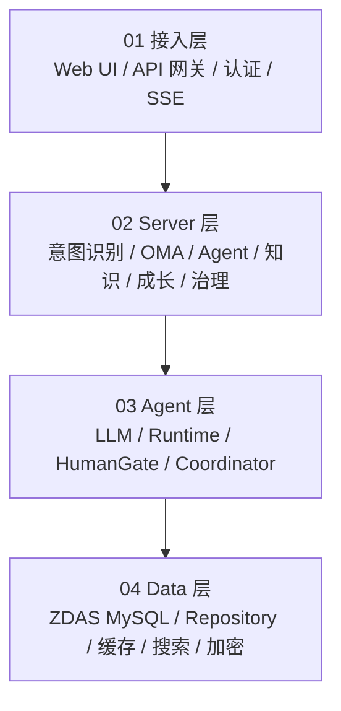
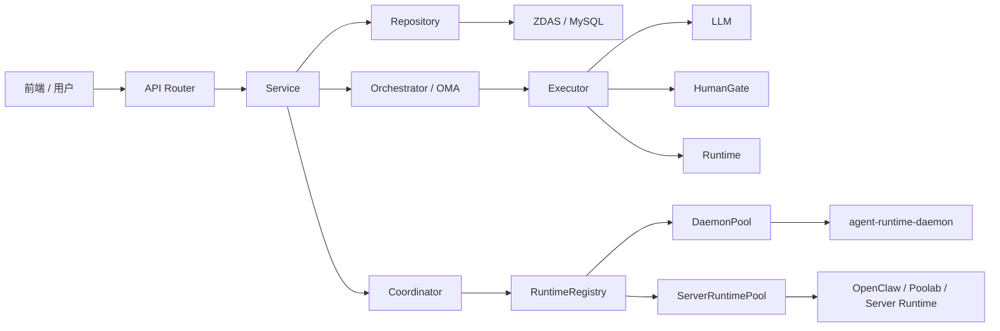
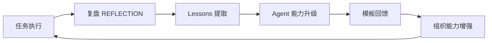

# 小IC工作台项目总文档

> 本文整合两批图片资料与当前目录下已有的《小IC工作台项目复现详细文档.md》，形成一份面向复现开发的总文档。第一批资料偏产品方案与系统能力，第二批资料偏真实工程框架、代码分层、运行路径、Runtime/Daemon、SSE、认证、测试和部署。拍屏图片存在局部模糊与反光，本文对无法完全辨认的细节做了工程化补全，最终实现时应以实际源码和运行环境为准。

## 1. 总体定位

小IC工作台，也可以理解为 Agent Center Server，是面向消金团队的多智能体编排平台。

它的核心目标不是简单提供一个聊天机器人，而是让多个 AI Agent 围绕用户目标协同完成复杂任务，形成从目标输入、意图识别、Agent 推荐、任务编排、Runtime 执行、人工确认、交付物生成到经验沉淀的闭环。

一句话：

```text
小IC工作台 = 消金团队的数字员工操作系统 + 多 Agent 任务编排平台 + Runtime 执行调度中心
```

核心价值：

- 对人：每个人拥有自己的 AI 分身实例与成长档案。
- 对组织：Agent 市场统一注册、训练、分配、升级各岗位数字员工。
- 对任务：把一次对话升级为可编排、可追踪、可验收的任务链路。
- 对基础设施：Server 是数据、任务、Runtime、权限和观测的唯一调度中心。

## 2. 传统方式与小IC方式

### 2.1 传统方式的问题

传统协作方式中，PD、研发、QA、PMO 各自独立使用 AI 工具，阶段间依靠人工交接文档和会议对齐。

主要问题：

- 信息丢失：上下文、约束、需求细节在交接中容易遗失。
- 人工拉会：同步、确认、排期和追问消耗大量时间。
- 经验不沉淀：优秀 Prompt、业务判断和复盘经验留在个人手里。
- 各自为战：缺少统一任务上下文、统一交付标准和统一执行链路。

### 2.2 小IC方式的变化

小IC工作台把“问 AI 一个问题”升级为“下达一个目标”。

典型链路：

```text
用户输入目标
-> IntentHint 意图识别
-> Agent Team 推荐
-> OMA 或 LangGraph 编排
-> Runtime/LLM/HumanGate 混合执行
-> SSE 实时推送
-> 阶段性交付与人工确认
-> 复盘、Lessons、EVOLUTION、模板升级
```

带来的变化：

- Task 产出即下游输入，减少上下文损耗。
- DAG 明确任务依赖、责任角色和执行顺序。
- Skybase、SOUL.md、知识上下文为 Agent 提供业务背景。
- 执行过程可观测、可暂停、可恢复、可审计。
- 经验通过复盘和模板回馈沉淀到组织层。

## 3. 能力全景

### 3.1 产品能力

| 能力域 | 说明 |
| --- | --- |
| 智能路由 | 首页输入目标后识别 Agent / Tasks / Dynamic / Goal 模式 |
| Agent 推荐 | 根据业务域、语义、能力丰富度、组织亲近度推荐分身 |
| 任务编排 | OMA Task DAG 或老 LangGraph 编排复杂任务 |
| 协同空间 | 房间、群聊、@mention、多 Agent 对话 |
| Runtime 管理 | 调度本地或远程 Runtime 执行真实任务 |
| HumanGate | 高风险节点暂停等待人工确认 |
| 成长中心 | 复盘、Lessons、EVOLUTION、模板回馈 |
| 知识注入 | Skybase、知识库、SOUL.md、Prompt 上下文 |

### 3.2 工程能力

| 能力域 | 说明 |
| --- | --- |
| Web API | FastAPI 风格 Router，Web 端口默认 8888 |
| SOFAPY | 主服务基于 ant-sofapy-base / SOFAPY 启动 |
| 数据访问 | ZDASManager 连接 MySQL，Repository 封装 CRUD |
| LLM 通道 | OpenAI HTTP、poolab WS、cursor-agent CLI、确定性 fallback |
| 实时通信 | WebSocket + SSE，支持 Daemon 双向通信和前端事件推送 |
| 设备鉴权 | ED25519 设备签名、Bearer Token、Mist/BUC 用户认证 |
| Runtime Provider | daemon 反连与 server-direct runtime 两条路线 |
| 测试部署 | tests 覆盖核心能力，Docker/nginx/admin scripts/migrations 支持部署 |

## 4. 总体架构

### 4.1 产品视角四层架构



### 4.2 工程视角三层架构

第二批图片中将工程概括为三层：

```text
Agent Center Server (Python)
  <-> WebSocket / SSE
Agent Runtime Daemon (TypeScript)
  <-> stdio/socket
本地 Runtime CLI (claudecode / codex / openclaw / poolab-ws 等)
```

职责拆分：

- Agent Center Server：中心调度、API、DB、OMA、协同、认证、事件推送。
- Agent Runtime Daemon：常驻客户端，桥接本地 Runtime CLI 与服务端。
- 本地 Runtime CLI：真正执行代码生成、文件操作、命令执行、工具调用。

### 4.3 分层调用关系



## 5. 推荐仓库结构

图片中出现过两种目录表达，合并后建议按下面结构理解。

```text
agentcenterserver/
  conf/
    docker/
      Dockerfile
      nginx.conf
      scripts/
  agentcenter/
    configs/
      application.yaml
    main.py
    auth/
    bridge/
    coordinator/
    daemon/
    db/
    orchestrator/
    runtime/
    security/
    servers/
      mcp/
      sofa/
      web/
    services/
    sse/
    observability/
  agent-runtime-daemon/
  tests/
  docs/
  CLAUDE.md
  DEPLOYMENT.md
  LEGAL.md
  README.md
  requirements.txt
  pytest.ini
```

### 5.1 根目录文件

| 文件 | 作用 |
| --- | --- |
| README.md | 项目说明、架构概览、本地开发入口 |
| CLAUDE.md | Claude Code 项目说明或开发约束 |
| DEPLOYMENT.md | 部署指南 |
| LEGAL.md | 法律免责声明 |
| requirements.txt | Python 依赖 |
| pytest.ini | pytest 配置 |

### 5.2 agentcenter 主服务目录

| 目录 | 作用 |
| --- | --- |
| configs/ | 应用配置，核心文件 application.yaml |
| main.py | Python 主服务入口 |
| servers/web/ | Web 服务与 FastAPI Router |
| servers/mcp/ | MCP 服务 |
| servers/sofa/ | SOFA RPC 服务 |
| services/ | 业务服务聚合层 |
| db/ | ZDAS/MySQL、Repository、DDL migration |
| orchestrator/ | LangGraph 老编排与 OMA 新编排 |
| runtime/ | Runtime 抽象、Provider、Registry |
| daemon/ | Daemon WebSocket 协议、连接池、处理器 |
| coordinator/ | 跨 Runtime 对话协调器 |
| auth/ | 用户认证与鉴权 |
| sse/ | SSE 事件总线 |
| security/ | 字段加密、Token、权限相关 |
| observability/ | 指标、链路追踪、观测 |

### 5.3 agent-runtime-daemon 子项目

图片中说明 agent-runtime-daemon 是 Node/TypeScript 项目，要求 Node >= 18。

```text
agent-runtime-daemon/
  src/
    auth/       # ED25519 设备身份、配对
    bridge/     # server websocket、本地 unix socket 控制面
    cli/        # agent-runtime-daemon CLI
    config/     # 本地配置读取
    daemon/     # Daemon 主入口、SessionManager
    runtime/    # Runtime 抽象、注册表、adapter
```

核心入口：

```text
agent-runtime-daemon/src/daemon/daemon.ts
```

启动后做的事：

1. 加载配置和设备身份。
2. 注册 claudecode、codex、openclaw adapter。
3. 检测本机 runtime。
4. 连接服务端 WebSocket。
5. 发送 daemon.register。
6. 发送 daemon.resume。
7. 启动本地控制面 unix socket。
8. 每 30 秒 heartbeat。

## 6. 技术栈

| 层级 | 技术 |
| --- | --- |
| 后端框架 | Python / FastAPI 风格 Web Router，基于 ant-sofapy-base / SOFAPY |
| 默认端口 | 8888，详见 agentcenter/configs/application.yaml |
| 本地 Daemon | TypeScript / Node.js，通过 WebSocket 桥接本地 Runtime CLI |
| 数据库 | MySQL，通过 ZDAS / Layotto 的 ZDASManager 访问 |
| 数据访问 | Repository 模式，50+ 领域 Repository |
| LLM 集成 | OpenAI HTTP API、Cursor CLI、poolab WS、确定性 fallback |
| 编排引擎 | LangGraph 固定状态机 + OMA 目标导向 DAG 编排 |
| 实时通信 | WebSocket daemon 双向通信 + SSE 前端事件推送 |
| 认证 | ED25519 设备签名、Bearer Token、Mist/BUC、Mock、本地信任 |
| 安全 | Fernet 字段级加密、敏感 Token 加密存储 |

## 7. 本地开发与启动

### 7.1 Python 主服务

图片中给出的本地开发命令：

```bash
python3.11 -m venv .venv
source .venv/bin/activate
pip install -r requirements.txt
cd agentcenter
python main.py
```

Windows PowerShell 可对应为：

```powershell
python -m venv .venv
.\.venv\Scripts\Activate.ps1
pip install -r requirements.txt
cd agentcenter
python main.py
```

Web 端口默认 8888，配置位置：

```text
agentcenter/configs/application.yaml
```

### 7.2 主服务启动流程

主入口：

```text
agentcenter/main.py
```

通过 SOFAPY run() 读取配置并启动模块，核心 Web 应用在：

```text
agentcenter/servers/web/app.py
```

启动生命周期主要做这些事：

1. 初始化 ZDAS 数据库连接。
2. 初始化认证配置 configure_auth()。
3. 初始化 OpenClay Gateway pool。
4. 初始化 LLM 通道并打印真实 provider。
5. 挂载 DaemonPool、RuntimeRegistry、Coordinator。
6. 挂载 ServerRuntimePool，启动 server-direct runtime。
7. bootstrap 内置 runtime agents：blueflame coding、quality e2e、BI、operation 等。
8. 将内置 runtime binding 注册到 registry。
9. 启动 daily review、discovery、OMA recovery。
10. 注册 FastAPI routers 和 /ws/daemon WebSocket。

### 7.3 TypeScript Daemon

Daemon 的启动命令在图片中未完整给出，但按目录和 Node 项目约定，复现时建议提供：

```bash
cd agent-runtime-daemon
npm install
npm run build
npm run start
```

也可以提供开发模式：

```bash
cd agent-runtime-daemon
npm install
npm run dev
```

Daemon 启动后应连接：

```text
ws://server/ws/daemon
```

并按协议完成注册、恢复、心跳、Runtime Session 执行。

## 8. Web API 分层

### 8.1 Router 位置

FastAPI router 集中挂在：

```text
agentcenter/servers/web/routers
```

### 8.2 主要 API 域

| 路由 | 说明 |
| --- | --- |
| /api/auth | 认证 |
| /api/agents | Agent 管理 |
| /api/agents/market | Agent 模板市场 |
| /api/agents/square | Agent 广场 |
| /api/chat | 单 Agent 对话 |
| /api/rooms | 房间 / 群聊 |
| /api/projects | 项目创建、编排、确认 |
| /api/knowledge | 知识库 |
| /api/events | SSE 事件流 |
| /api/dialog/send | Runtime / Coordinator 对话入口 |

### 8.3 Router 职责边界

Router 应只做：

- 参数校验。
- 认证用户获取。
- 调用 service。
- 返回响应。

业务逻辑应下沉到：

```text
agentcenter/services
```

持久化逻辑应下沉到：

```text
agentcenter/db/repositories
```

## 9. Service 业务服务层

图片中明确指出：

```text
agentcenter/services 是业务能力聚合层，router 通常只做参数校验和调用 service/repository。
```

核心服务如下：

| 文件 | 职责 |
| --- | --- |
| oma_orchestrator_service.py | OMA 新编排入口，桥接 SSE + DB 持久化 |
| orchestrator_service.py | 老编排 / 内存任务服务 |
| room_service.py | 房间 / 群聊逻辑 |
| room_llm_service.py | 房间内 LLM 流式输出 |
| intent_service.py | 首页意图识别，决定 agent / tasks / dynamic / goal |
| dag_synthesizer.py | 动态 DAG 生成 |
| goal_service.py | Goal 模式业务封装 |
| runtime_task_service.py | Runtime task 执行封装 |
| knowledge_context_service.py | 编排阶段知识上下文 |
| skybase_* | Skybase 业务知识库接入 |
| media_service.py | 文件 / 媒体 |
| push_service.py | 推送 |
| agent_recommendation_service.py | Agent 推荐 |
| buc_user_service.py | BUC 用户信息 |

### 9.1 Service 层复现原则

实现时建议遵循：

- Router 不直接操作数据库。
- Service 负责任务业务流程和跨模块协调。
- Repository 只负责数据持久化。
- OMA、Runtime、Coordinator 作为可独立测试的核心域。
- SSE 事件通过统一 EventBus 发布。

## 10. 数据访问层

### 10.1 数据库入口

数据库访问从下面文件开始：

```text
agentcenter/db/database.py
```

图片中说明其通过 SOFAPY Layotto 的 ZDASManager 拿 MySQL 连接，并用 asyncio.to_thread 包装同步 mysql connector。

### 10.2 Repository 基类

核心 Repository 文件：

```text
agentcenter/db/sql_repository.py
agentcenter/db/base_repository.py
agentcenter/db/repositories/
```

职责：

- 通用 SQL CRUD。
- JSON 列处理。
- 加密列处理。
- org scope 组织隔离。
- 每张业务表对应一个 repository。

### 10.3 数据模型约定

数据模型基本由 Pydantic 模型承载，Repository 子类声明：

```python
table_name = "xxx"
model_class = XxxModel
json_columns = (...)
encrypted_columns = (...)
org_scoped = True
```

### 10.4 DDL 与迁移

DDL 位于：

```text
agentcenter/db/migrations
```

图片中提到的迁移包括：

- runtime schema。
- dialog partition。
- daemon token。
- OMA 编排表。
- server runtime 表。

### 10.5 字段级加密

敏感字段通过下面模块做 Fernet 字段级加密：

```text
agentcenter/security/field_cipher.py
```

典型加密列包括：

- server_runtimes.private_key。
- server_runtimes.bearer_token。
- daemon_bearer_tokens.token。
- 其他访问凭证和敏感密钥。

## 11. 编排系统

项目中有两套编排路径并存：

```text
老路径：LangGraph 固定阶段状态机
新路径：OMA Task DAG
```

这是复现和维护时最需要关注的部分之一。

### 11.1 老路径：LangGraph 固定阶段

老路径是固定 9 阶段状态机。

核心文件：

```text
agentcenter/orchestrator/graph.py
agentcenter/orchestrator/engine.py
agentcenter/orchestrator/nodes
```

图片中展示的流程：

```text
brainstorm
-> prd_draft
-> human_confirm_prd
-> review
-> prd_final
-> human_confirm_final
-> task_split
-> execution
-> synthesis
-> human_confirm_synthesis
-> END
```

适用场景：

- 老版本项目创建。
- 固定产品研发链路。
- 需要稳定流程但灵活性较低的任务。

### 11.2 新路径：OMA Task DAG

OMA = Objective-Motivated Agent，目标导向型编排。

OMA 是项目级编排，而普通 Dialog 是对话级编排。

入口与核心文件：

```text
入口服务：agentcenter/services/oma_orchestrator_service.py
编排器：agentcenter/orchestrator/oma/orchestrator.py
Task 抽象：agentcenter/orchestrator/oma/task.py
执行器：agentcenter/orchestrator/oma/executors
模板：agentcenter/orchestrator/templates
```

OMA 提供两个入口：

```python
run_agent(agent_id, prompt)   # 单 agent 单任务
run_tasks(team, tasks)        # 基于 Task DAG 编排
```

### 11.3 OMA 核心抽象

| 抽象 | 说明 |
| --- | --- |
| Task | 最小调度单元 |
| TaskKind | llm / runtime / human_gate / brainstorm / prd_draft 等 |
| TaskQueue | DAG 拓扑队列，失败级联 |
| AgentPool | 全局和 Agent 并发限流 |
| Executor | 不同 TaskKind 的执行器 |
| MemoryStore | run 级共享记忆，优先 ZDAS，失败回退内存 |
| RunTrace | 执行链路追踪 |

### 11.4 OMA 执行示例

图片中的“产品开发”工作流示例：

```text
Task 1: brainstorm     LLM 执行，无依赖 -> 产出想法列表
Task 2: prd_draft      LLM 执行，依赖 Task1 -> 产出需求文档
Task 3: review         群聊执行，依赖 Task2 -> 多 agent 评审 PRD
Task 4: human_confirm  人工确认，依赖 Task3 -> 等用户点通过
Task 5: task_split     LLM 执行，依赖 Task4 -> 拆分开发任务
Task 6: execution      Runtime 执行，依赖 Task5 -> agent 写代码
```

DAG 执行引擎会：

1. 先跑无依赖 Task。
2. Task 完成后自动解锁后继节点。
3. Review 阶段让多个 Agent 在群聊中讨论并达成共识。
4. HumanGate 暂停执行，通过 SSE 推送给前端等待用户确认。
5. 用户通过后，继续后续 Task。

### 11.5 内置 OMA 模板

| 模板 | 说明 |
| --- | --- |
| full_v1 | 完整 9 阶段 |
| product_dev_v1 | 产品研发链路，PD -> DEV/QA 评审 -> 研发交付 -> 测试 -> 摘要 |
| marketing_activity_v1 | 营销活动链路，BI 分析 -> 人工确认 -> 运营配置 -> 上线 |

### 11.6 OMA 事件与持久化

OMA 运行事件通过 SSE 推送：

```text
run.started
run.dag.updated
run.task.*
run.completed
```

并写入：

```text
orchestrator_runs
orchestrator_tasks
orchestrator_memories
```

## 12. 意图识别与模式路由

首页输入后由 IntentHint / intent_service 判断模式。

四种模式：

| 模式 | 说明 |
| --- | --- |
| agent | 简单对话或单 Agent 任务 |
| tasks | 命中 SOP / 模板，走标准 DAG |
| dynamic | 无模板，动态生成 DAG |
| goal | 长周期目标托管，持续 replan |

典型逻辑：

```text
用户输入
-> 语义分析
-> 判断复杂度、时间跨度、信号词
-> 模板匹配
-> Agent 推荐
-> 输出 mode + confidence + preview_required
```

需要注意：

- README 中描述“未传 mode 默认老 LangGraph”。
- 新图片中提示 projects.py 当前行为与 README 不完全一致。
- 复现时必须统一默认 mode 行为，建议默认走 OMA，老 LangGraph 只作为 legacy 显式模式保留。

## 13. 项目创建核心请求流

图片中给出的项目创建流程：

```text
POST /api/projects
-> projects.py 创建 project + room
-> mode=None/agent：只建聊天项目
-> mode=tasks/dynamic：后台启动 OMA template
-> mode=legacy：启动 LangGraph
-> SSE 推送 phase/task/human gate
-> Repository 落 ZDAS
```

建议复现时定义清晰的请求结构：

```json
{
  "name": "蓝花火浏览历史模块开发",
  "goal": "新增阅读过的话题列表",
  "mode": "tasks",
  "template_id": "product_dev_v1",
  "agent_ids": ["pd_agent", "dev_agent", "qa_agent"],
  "preview_required": true
}
```

建议响应：

```json
{
  "project_id": "project_001",
  "room_id": "room_001",
  "run_id": "run_001",
  "mode": "tasks",
  "status": "created"
}
```

## 14. Runtime / Daemon 架构

服务端支持两种 Runtime 通路。

### 14.1 第一种：Daemon 反连服务端

链路：

```text
agent-runtime-daemon
-> ws://server/ws/daemon
-> agentcenter/daemon/ws_handler.py
-> DaemonPool
-> RuntimeRegistry
-> Coordinator
-> RuntimeSession
```

特点：

- 适合本地开发机或用户侧机器主动连接平台。
- 服务端不需要直接访问用户机器。
- 通过 WebSocket 维持双向通信。

### 14.2 Daemon 协议

协议定义：

```text
agentcenter/daemon/protocol.py
```

协议分为 req、res、event。

主要 method/event：

```text
daemon.register
daemon.resume
runtime.report
agents.sync
runtime_session.start
runtime_session.send
runtime_session.cancel
runtime_session.close
runtime_session.chunk
runtime_session.final
runtime_session.error
daemon.heartbeat
```

### 14.3 第二种：server-direct runtime

链路：

```text
server_runtimes 表
-> ServerRuntimePool
-> OpenClawClient / OpenClawMcpClient / PoolabWsClient
-> CoordinatorProvider 抽象
```

核心文件：

```text
agentcenter/runtime/providers/server_pool.py
agentcenter/runtime/providers/base.py
```

特点：

- 服务端直接持有 runtime provider。
- 适合云端托管 runtime 或平台内置执行能力。
- 不依赖用户侧 daemon 反连。

### 14.4 RuntimeRegistry

Runtime 索引在下面文件维护：

```text
agentcenter/runtime/registry.py
```

维护两类映射：

```text
(provider_id, runtime_type) -> RuntimeRecord
(org_id, mention_alias) -> AgentRecord
```

也就是说，当用户输入 @某个别名 后，Coordinator 会从 registry 找到对应 agent、runtime_type、provider_kind、provider_id，再分发到 daemon 或 server-direct provider。

## 15. Runtime 对话链路

入口：

```text
POST /api/dialog/send
```

Router：

```text
agentcenter/servers/web/routers/dialog.py
```

核心主控：

```text
agentcenter/coordinator/coordinator.py
```

流程：

```text
POST /api/dialog/send
-> Coordinator.start_dialog
-> RuntimeRegistry 解析 @alias
-> RuntimeProvider 选择 daemon 或 server-direct
-> runtime_session.start / send
-> chunk / final / error 回流
-> dialog_messages 落库
-> SSE 推给前端
```

Coordinator 职责：

- 解析 @mention。
- 根据 policy 选择下一发言者。
- 创建或复用 runtime_session。
- 发送 runtime_session.start/send。
- 接收 chunk/final/error。
- 累积流式输出。
- final 时落 dialog_messages。
- 通过 SSE 推 dialog.delta、dialog.final、dialog.error。
- 使用 LoopGuard 防止无限循环。

支持策略：

| 策略 | 说明 |
| --- | --- |
| mention | 基于 @mention 接力 |
| roundtable | 圆桌轮流发言 |
| coordinator | 主持人调度 |

## 16. TypeScript Daemon 细节

### 16.1 目录职责

| 目录 | 职责 |
| --- | --- |
| src/auth | ED25519 设备身份、配对 |
| src/bridge | server websocket、本地 unix socket 控制面 |
| src/cli | agent-runtime-daemon CLI |
| src/config | 本地配置读取 |
| src/daemon | Daemon 主入口、SessionManager |
| src/runtime | Runtime 抽象、注册表、adapter |

### 16.2 Runtime Adapter 接口

接口位于：

```text
agent-runtime-daemon/src/runtime/base.ts
```

核心方法：

```typescript
startSession()
send()
cancel()
close()
```

其中 send() 返回：

```typescript
AsyncIterable<RuntimeChunk>
```

SessionManager 会把 Runtime 输出转换成协议层的 chunk / final 事件，发回服务端。

### 16.3 设备鉴权

Daemon 通过 ED25519 设备身份接入。

建议复现协议：

```text
1. daemon 请求 challenge
2. server 返回 challenge
3. daemon 使用私钥签名
4. server 验证公钥和签名
5. server 下发 bearer token
6. daemon 通过 /ws/daemon 建立长连接
7. daemon 每 30 秒 heartbeat
```

## 17. LLM 通道

统一 LLM 通道位于：

```text
agentcenter/orchestrator/llm_client.py
```

Provider 自动路由：

```text
openai HTTP
-> poolab WS
-> cursor-agent CLI
-> deterministic fallback
```

用途：

- 意图识别。
- DAG 生成。
- 头脑风暴。
- 评审。
- PRD 生成。
- 总结。
- 复盘。

复现建议：

- 第一版先实现 OpenAI HTTP + deterministic fallback。
- 统一结构化输出能力，供 IntentHint 和 DAG Synthesizer 使用。
- 记录 token、model、latency、fallback_reason。

## 18. 知识库与 Skybase

知识底座主要是 Skybase。

相关文件：

```text
skybase_client.py
skybase_config.py
skybase_knowledge_backend.py
knowledge_context_service.py
skybase_domain.py
skybase_catalog_index.py
```

配置在：

```text
application.yaml 的 skybase 段
```

能力：

- 业务域识别。
- 领域词提取。
- 编排阶段知识上下文注入。
- Agent 推荐中的业务域锚定。
- fallback 到静态知识或本地文档。

建议复现：

- 先用本地 Markdown/JSON 作为 Skybase mock。
- 再接向量检索和 BM25 混合检索。
- 最后接真实 Skybase 服务。

## 19. SSE 事件系统

事件总线文件：

```text
agentcenter/sse/event_bus.py
```

前端订阅入口：

```text
GET /api/events/stream
```

事件前缀包括：

```text
chat.stream.*
room.stream.*
room.message
project.phase.changed
project.task.updated
project.human.input.*
run.dag.updated
run.task.*
dialog.*
agents.updated
```

SSE 用途：

- 前端实时展示任务状态。
- HumanGate 等待用户确认。
- Runtime chunk 流式输出。
- Dialog delta/final/error 推送。
- 支持进程内 listener 做事件桥接。

复现建议：

- 用统一 EventEnvelope：

```json
{
  "event": "run.task.started",
  "run_id": "run_001",
  "task_id": "task_001",
  "payload": {},
  "created_at": "2026-06-05T23:00:00+08:00"
}
```

## 20. 认证与权限

认证集中在：

```text
agentcenter/auth/auth_service.py
```

图片中给出的优先级：

```text
mockid URL 参数
MOCK_AUTH
SOFAPY Antbuserservice 注入用户
静态 Bearer / X-API-Key
BUC / IAM_TOKEN / MOSN header
可选 legacy JWT
TRUST_LOCAL 本地信任
```

Web router 通过：

```python
Depends(get_current_user)
```

获取：

```text
AuthenticatedUser
```

复现建议：

- 开发环境支持 MOCK_AUTH。
- 生产环境关闭 TRUST_LOCAL。
- API Key 和 Bearer Token 使用加密存储。
- HumanGate、Runtime 执行、项目删除等操作必须审计。

## 21. Agent 推荐

上一份文档中整理出的推荐公式：

```text
综合得分 =
  业务域锚定 40%
  + 语义相关度 30%
  + 能力丰富度 15%
  + 组织亲近度 15%
```

对应服务：

```text
agentcenter/services/agent_recommendation_service.py
```

推荐流程：

```text
候选池加载
-> 批量加载 SOUL.md / agent_soul_cache
-> 构建分身文本
-> 提取任务信号
-> 四维加权评分
-> 截断 Top-N
```

复现时要保存推荐理由，方便用户理解为什么推荐某个 Agent。

## 22. HumanGate 人工确认

HumanGate 是平台从“自动执行”走向“可控交付”的关键机制。

典型触发点：

- PRD 确认。
- 方案确认。
- 高风险策略变更。
- 代码发布。
- 上线审批。
- 最终交付确认。

运行机制：

```text
DAG 执行到 human_gate
-> Task 状态置为 waiting
-> SSE 推 project.human.input.* 或 run.task.human_gate.waiting
-> 前端展示确认面板
-> 用户 approve/reject
-> OMA 继续或终止 / replan
```

建议 API：

```http
POST /api/human-gates/{gate_id}/approve
POST /api/human-gates/{gate_id}/reject
```

## 23. 成长与自迭代

Agent 自迭代由四步组成：

```text
复盘 -> 经验提取 -> 代际进化 -> 模板回馈
```

产物：

- REFLECTION.md。
- Lessons。
- EVOLUTION.md。
- 模板升级记录。
- CapabilityScore 回写。

飞轮：



## 24. 测试与部署

### 24.1 测试覆盖

图片中列出的测试覆盖面较广：

```text
Repository / 加密
Runtime / Daemon / ServerRuntimePool
Coordinator / Dialog
OMA orchestrator / templates / task queue / goal mode
Intent / room service / LLM service
Skybase knowledge
API integration
metrics
```

复现建议：

- OMA 拓扑调度必须有单元测试。
- HumanGate 暂停/恢复必须有集成测试。
- Daemon 协议必须有 mock websocket 测试。
- Repository 加密列必须有回归测试。
- SSE 事件至少覆盖 run、dialog、human_gate 三类。

### 24.2 部署材料

部署相关材料：

```text
DEPLOYMENT.md
conf/docker/Dockerfile
conf/docker/nginx.conf
conf/docker/scripts/admin/bin/*.sh
agentcenter/db/migrations/*.sql
```

建议部署形态：

```text
nginx
-> agentcenter web server
-> MySQL / ZDAS
-> Redis / cache
-> Runtime daemon / server-direct runtime
```

## 25. 核心请求流程总结

### 25.1 项目创建

```text
POST /api/projects
-> 创建 project + room
-> 判断 mode
-> agent：仅创建聊天项目
-> tasks/dynamic：启动 OMA
-> legacy：启动 LangGraph
-> SSE 推送阶段和任务事件
-> Repository 持久化
```

### 25.2 Runtime 对话

```text
POST /api/dialog/send
-> Coordinator.start_dialog
-> RuntimeRegistry 解析 @alias
-> RuntimeProvider 选择 daemon 或 server-direct
-> runtime_session.start / send
-> chunk / final / error 回流
-> dialog_messages 落库
-> SSE 推给前端
```

### 25.3 Daemon 接入

```text
agent-runtime-daemon start
-> ED25519 challenge + token
-> /ws/daemon
-> daemon.register / runtime.report / agents.sync
-> RuntimeRegistry 建索引
-> Coordinator 可调度本机 runtime
```

## 26. 复现版本规划

### 26.1 MVP 必做

第一版应优先打通主闭环：

```text
目标输入
-> 意图识别
-> 项目创建
-> OMA 模板 DAG
-> LLM Executor
-> HumanGate
-> SSE 推送
-> 交付物
-> REFLECTION
```

MVP 模块：

- FastAPI Web API。
- SQLite/PostgreSQL/MySQL 任一数据库先跑通 Repository。
- /api/projects。
- /api/intent/analyze。
- /api/events/stream。
- OMA Task、TaskQueue、Executor。
- product_dev_v1 模板。
- LLM Gateway。
- HumanGate 确认。
- 基础任务中心前端或简单管理页面。

### 26.2 第二阶段

加入 Agent 和知识：

- Agent Profile。
- SOUL.md。
- Agent 推荐。
- Skybase mock。
- 房间 / 群聊。
- Coordinator mention / roundtable。

### 26.3 第三阶段

加入 Runtime：

- agent-runtime-daemon。
- ED25519 设备注册。
- /ws/daemon。
- RuntimeSession 协议。
- codex / claudecode adapter。
- Runtime chunk 流式回传。

### 26.4 第四阶段

生产增强：

- ZDAS/MySQL。
- 字段级加密。
- RBAC。
- 审计。
- BudgetGuard。
- OpenTelemetry。
- Docker/nginx 部署。
- OMA recovery。
- Goal 模式。
- Agent 版本管理和模板市场。

## 27. 推荐实现目录

如果从零复现，建议采用下面目录。

```text
xiaoc-workbench/
  README.md
  docker-compose.yml
  .env.example

  backend/
    pyproject.toml
    app/
      main.py
      api/
        routers/
      auth/
      config/
      db/
        migrations/
        repositories/
      services/
        intent/
        project/
        agent/
        room/
        knowledge/
        growth/
      orchestrator/
        oma/
          task.py
          queue.py
          orchestrator.py
          executors/
        templates/
      runtime/
        providers/
        registry.py
      daemon/
        protocol.py
        ws_handler.py
      coordinator/
      sse/
      security/
      observability/

  agent-runtime-daemon/
    package.json
    src/
      auth/
      bridge/
      cli/
      config/
      daemon/
      runtime/

  frontend/
    package.json
    src/
      pages/
      components/
      services/
      stores/

  templates/
    product_dev_v1.yaml
    marketing_activity_v1.yaml

  docs/
    architecture.md
    api.md
    runtime-protocol.md
```

## 28. 关键风险与维护点

### 28.1 LangGraph 与 OMA 并存

当前资料显示老 LangGraph 和新 OMA 并存，且 README 与 projects.py 对默认 mode 的描述可能不完全一致。

建议：

- 明确定义 mode 默认值。
- legacy 模式显式调用 LangGraph。
- 新任务默认 OMA。
- 文档、接口和代码保持一致。

### 28.2 Runtime Provider 双路径

Runtime 同时支持 daemon 反连和 server-direct。

建议：

- RuntimeRegistry 作为唯一索引。
- Provider 选择逻辑集中在一个模块。
- 日志中必须打印 provider_kind、provider_id、runtime_type。
- 失败时明确 fallback 策略。

### 28.3 SSE 与 DB 一致性

SSE 推送和 DB 持久化必须一致。

建议：

- 先写 DB，再发事件，或者事件中包含可恢复状态。
- OMA recovery 根据 DB 状态恢复 run。
- 前端断线后可重新拉取 run 状态。

### 28.4 Runtime 安全

Runtime 会执行真实命令或操作文件。

建议：

- 默认沙箱。
- 命令白名单。
- 项目路径隔离。
- 输出过滤。
- 审计日志。
- 高风险动作必须 HumanGate。

### 28.5 Agent 经验污染

自动把经验写回 SOUL.md 或模板可能引入错误。

建议：

- Lessons 有置信度。
- 模板升级需要审核。
- Agent 版本可回滚。
- 多次任务验证后再进入组织模板。

## 29. 最小数据表清单

MVP 不需要一次实现 49+ 表，但至少需要：

| 表 | 用途 |
| --- | --- |
| users | 用户 |
| agents | Agent |
| agent_profiles | 分身 Profile |
| projects | 项目 |
| rooms | 协同房间 |
| messages | 消息 |
| orchestrator_runs | OMA 运行实例 |
| orchestrator_tasks | OMA Task |
| orchestrator_memories | run 级记忆 |
| human_gates | 人工确认 |
| runtime_daemons | Daemon |
| runtime_sessions | Runtime 会话 |
| runtime_events | Runtime 事件 |
| knowledge_docs | 知识文档 |
| reflections | 复盘 |
| lessons | 经验 |
| audit_logs | 审计 |

## 30. 验收标准

总体验收：

- 用户可以创建一个项目目标。
- 系统可以识别 mode。
- 系统可以创建 project + room。
- tasks/dynamic 可以启动 OMA。
- OMA 可以加载 product_dev_v1 模板。
- DAG 可以按依赖推进。
- HumanGate 可以暂停并等待用户确认。
- SSE 可以实时推 run.task.* 事件。
- LLM Executor 可以生成 PRD / 总结。
- Runtime Provider 至少有一个 mock 或本地 adapter。
- 任务完成后能生成 REFLECTION。
- 数据能落库并可恢复查看。

工程验收：

- Router、Service、Repository 分层清晰。
- OMA、Runtime、Coordinator 有单元测试。
- 认证支持 mock 和 bearer。
- 敏感字段加密。
- 部署文档可执行。
- README 与代码实际默认行为一致。

## 31. 图片资料索引

### 31.1 第一批产品方案图片

| 图片 | 内容 |
| --- | --- |
| 1 | 为什么需要小IC工作台 |
| 2 | 平台定位与核心价值 |
| 3 | 小IC工作台系统架构 |
| 4 | 意图识别与模式路由 |
| 5 | OMA 任务编排引擎 |
| 6 | 角色分配 |
| 7 | 多 Runtime 管理 |
| 8 | Agent 自迭代 |
| 9 | 落地现状与演进 |
| 10 | 一点思考 |

### 31.2 第二批工程框架图片

| 图片 | 内容 |
| --- | --- |
| 1 | 仓库目录、本地开发命令、Docker/配置/Daemon/tests/docs |
| 2 | Agent Center Server 技术栈、三层架构 |
| 3 | OMA 编排引擎、Task DAG、LLM 回退 |
| 4-5 | 总体定位、目录结构、启动与服务装配、Web API |
| 6-7 | Service 层、DB/Repository、加密、老 LangGraph 与新 OMA |
| 8 | OMA 核心抽象、模板、SSE 事件、Runtime/Daemon 架构 |
| 9-10 | Daemon 协议、server-direct runtime、Coordinator 对话策略、TypeScript daemon |
| 11 | LLM 通道、Skybase、SSE 事件、认证优先级 |
| 12-13 | 测试部署、项目创建、Runtime 对话、Daemon 接入、分层评价 |
| 14 | 总体分层评价与关键维护点 |

## 32. 结论

这个项目的本质是一个“中心调度型多 Agent 工作台”。产品层关注从目标到交付的业务闭环，工程层关注如何把 Agent、LLM、Runtime、知识库、人工确认和事件流稳定地组织在一起。

复现时不要一开始追求完整 Agent 市场和全部 49+ 表。正确路径是先打通 OMA 主链路，再接入 Runtime Daemon，最后补齐知识、成长、治理和生态能力。

推荐优先级：

```text
项目创建 + OMA DAG + SSE + HumanGate
-> Agent 推荐 + 知识上下文
-> Runtime Daemon
-> 成长中心
-> 生产治理和部署
```

