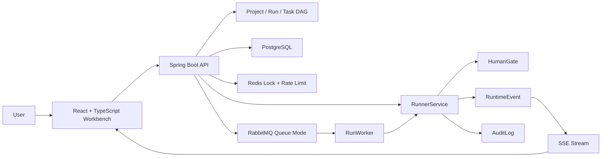

# Phase 07: Interview Demo Guide

## 怎么使用这份文档

这份文档不是给机器看的，是给你面试前反复练习用的。你可以把它当成一份“项目讲解教案”：先背熟主线，再理解每个技术点为什么出现，最后练习在不同面试官追问下切换讲法。

建议按这个顺序练：

1. 先读“一句话项目介绍”和“三分钟讲项目”，确保你能不用看代码说清楚项目价值。
2. 再读“十分钟演示路线”，按顺序打开页面、点击按钮、解释页面变化。
3. 然后读“架构讲法”和“按阶段解释亮点”，把 Phase 2 到 Phase 6 串成一条技术成长线。
4. 最后读“技术追问回答”和“Demo 失败时怎么救场”，准备面试里的临场问答。

这份文档的重点不是让你显得什么都懂，而是让你说得具体、真实、能落到代码和现象上。面试官更相信“我做了什么、为什么这么做、怎么验证它”这种回答，而不是堆名词。

常见误区：一上来就讲 Redis、RabbitMQ、SSE、React。这样会像背八股。更好的顺序是先讲业务闭环，再讲系统怎么支撑这个闭环。

## 学习目标

练完 Phase 7，你应该能做到：

- 30 秒说清楚这个项目是什么。
- 3 分钟讲清楚业务背景、核心流程、技术栈和你的职责。
- 10 分钟现场演示从输入目标到产出交付物的完整链路。
- 解释为什么项目里需要 HumanGate、SSE、AuditLog、Redis、RabbitMQ、Docker Compose。
- 区分 local queue 模式和 rabbit queue 模式的演示价值。
- 面对技术追问时能回到代码边界，而不是只说概念。
- Demo 出错时能快速切换到备用路线，不在现场慌乱排查。
- 把这个项目写进简历时能突出工程价值，而不是只写“用了某某技术”。

常见误区：把“项目介绍”讲成“技术栈列表”。技术栈只是工具，项目亮点来自你用这些工具解决了哪些具体问题。

## 一句话项目介绍

推荐版本：

```text
这是一个面向银行信用卡分期活动研发协作的 AgentOps 工作台，
用户输入业务目标后，系统会分析意图、推荐协作角色、生成任务 DAG，
并通过 Runner、HumanGate、事件流、审计日志和交付物输出，模拟从需求到交付的端到端研发闭环。
```

如果面试官偏业务，可以说：

```text
它模拟的是“银行要上线一个信用卡分期营销活动”时，产品、研发、测试、风控、PMO 如何协同推进需求、审批、风险校验和交付。
```

如果面试官偏技术，可以说：

```text
它是一个 Spring Boot + React 的全栈项目，后端围绕 Project、Run、Task DAG、HumanGate、RuntimeEvent 建模，
前端用 TypeScript 工作台展示流程状态，Phase 6 又加入 Redis 并发保护、RabbitMQ 异步队列和 Docker Compose 本地中间件环境。
```

常见误区：一句话里塞太多技术名词。第一句话应该让人知道“这项目解决什么问题”，技术细节放到后面展开。

## 三分钟讲项目

可以照这个结构讲：

```text
这个项目来自一个银行信用卡分期活动配置与审批的场景。
真实业务里，一个活动从需求到上线会经过产品设计、研发实现、测试验证、风控审核、灰度发布和审计留痕。
我把这个过程抽象成一个 AgentOps 工作台。

用户在前端输入目标后，后端先做意图分析，判断业务域、风险等级和需要哪些角色；
然后推荐 PD、DEV、QA、RISK、PMO 等 Agent；
接着创建 Project、Room、Run 和任务 DAG。

Runner 会按 DAG 推进任务，执行到需要人工确认的节点时进入 HumanGate。
前端通过 SSE 看到运行事件，用户 approve 后，Runner 继续完成后续任务，
最后生成 artifact、reflection、lessons，同时记录 RuntimeEvent 和 AuditLog。

工程上，我分阶段做了后端建模、Runner、人审、事件流、前端工作台、Redis/RabbitMQ/Docker Compose。
目前默认 local queue 保证演示稳定，也支持 rabbit queue 模式把启动 run 交给后台 worker 异步处理。
```

这三分钟里要注意三件事：

- 先讲业务，再讲技术。
- 每个技术点都和流程中的一个问题绑定。
- 不要说“智能体自动完成所有工作”，这个项目更准确的定位是“模拟多角色研发协作闭环”。

常见误区：讲得像“我做了一个后台管理系统”。这个项目的核心不是 CRUD，而是工作流状态推进、人工审批、事件可观测和工程化运行环境。

## 十分钟演示路线

推荐现场优先演示 local queue 模式。local 模式路径短，结果稳定，适合面试时间有限的场景。

### 第 1 分钟：介绍页面

打开前端：

```text
http://127.0.0.1:5173/
```

你可以说：

```text
这是一个工作台，不是宣传页。左侧输入业务目标，中间展示项目运行和任务 DAG，右侧处理人工审批、事件和审计。
```

要点：强调这是实操工作台，第一屏就能跑流程。

### 第 2 分钟：Analyze

点击 Analyze。

你可以说：

```text
这里调用后端 intent analyze 接口。它会把自然语言目标转换成结构化信息，
例如业务域、风险等级、是否需要人工门禁、候选角色。
```

要点：自然语言输入没有直接变成任务，而是先变成可解释的结构化意图。

### 第 3 分钟：Recommend Agents

页面会展示推荐角色。

你可以说：

```text
Agent 不是大模型进程，而是协作角色抽象。这里用 PD、DEV、QA、RISK、PMO 来模拟真实项目里的职责分工。
```

要点：不要把 Agent 夸大成真正自主智能体，保持诚实。

### 第 4 分钟：Create Project

点击 Create Project。

你可以说：

```text
创建项目时，后端会生成 Project、Room、Run、Task 和 DAG edges。
DAG 的好处是表达任务依赖，而不是只有一个线性的状态字段。
```

要点：把“项目创建”讲成领域建模，而不是普通插入数据库。

### 第 5 分钟：Start Run

点击 Start Run。

你可以说：

```text
Runner 会按 DAG 推进任务。执行到需要人确认的节点时，系统停止在 HumanGate。
这个设计是为了表达真实研发流程里关键节点不能完全自动化，例如 PRD 范围确认和风险审批。
```

要点：HumanGate 是业务合理性，不是技术限制。

### 第 6 分钟：看 SSE 和 DAG

观察事件时间线和任务状态变化。

你可以说：

```text
后端写 RuntimeEvent，前端用 SSE 订阅事件流。
SSE 适合这种服务器向浏览器推送运行状态的场景，比前端每秒轮询更直接。
```

要点：SSE 是状态可观测能力，不是为了炫技。

### 第 7 分钟：Approve HumanGate

输入理由并 approve。

你可以说：

```text
approve 会记录 AuditLog，并推动 Runner 继续执行后续任务。
这个动作会影响业务状态，所以需要留痕。
```

要点：审批动作必须可审计，这是银行场景的关键。

### 第 8 分钟：看交付物

查看 artifact、reflection、lessons。

你可以说：

```text
artifact 是交付物，reflection 是复盘，lessons 是沉淀。
这让流程不只是状态完成，而是形成一个可展示的闭环。
```

要点：闭环包括输入、过程、审批、结果和复盘。

### 第 9 分钟：讲 Phase 6 工程化

如果时间允许，切到架构解释：

```text
默认 local queue 直接调用 RunnerService，适合稳定演示。
rabbit queue 模式会把 RunStartMessage 发到 RabbitMQ，由 RunWorker 异步消费。
两条路径都通过 Redis run 锁保护同一个 run 不被重复推进，并用 Redis 做启动限流。
Docker Compose 则保证 PostgreSQL、Redis、RabbitMQ 的本地环境可复现。
```

要点：local 和 rabbit 是两种运行模式，不是互相替代的“谁更高级”。

### 第 10 分钟：收尾

你可以说：

```text
这个项目我最想体现的是：我不是只做页面或 CRUD，而是按真实后端工程拆了领域模型、状态机、事件流、人审、审计、并发保护、异步队列和本地环境。
每一阶段都有测试和文档，便于复现和讲解。
```

常见误区：演示时不停读页面文字。你应该解释“为什么页面变成这样”，而不是念 UI。

## 架构讲法

可以用这张逻辑图记忆：



讲架构时分三层：

```text
前端层: React + TypeScript 工作台，负责输入目标、展示 DAG、处理审批、展示事件和交付物。
后端层: Spring Boot，负责意图分析、项目建模、Runner、人审、事件、审计、队列抽象。
基础设施层: PostgreSQL 持久化业务数据，Redis 做短期协调状态，RabbitMQ 做异步启动队列，Docker Compose 负责本地环境。
```

不要一口气讲完所有类。面试官问到哪里，再展开到对应文件。

常见误区：把架构图画得太复杂。面试里的图应该帮助对方理解主链路，不是展示所有表和所有类。

## 按阶段解释亮点

### Phase 2：Intent / Agent / Project

你可以说：

```text
Phase 2 先把业务目标结构化，建立 Project、Room、Run、Task、Edge 等核心模型。
这一步解决的是“系统里到底有哪些领域对象”的问题。
```

亮点：

- 不是直接把用户输入存起来，而是转成可执行的项目结构。
- 用 DAG edge 表达任务依赖。
- Agent 是角色抽象，帮助解释协作分工。

### Phase 3：Runner / HumanGate

你可以说：

```text
Phase 3 加了 Runner，让 run 可以按 DAG 推进。
遇到关键节点时停在 HumanGate，等待人工 approve 或 reject。
```

亮点：

- Runner 是状态推进核心。
- HumanGate 表达真实业务里的人工决策。
- approve/reject 会改变 run 和 task 状态。

### Phase 4：SSE / RuntimeEvent / AuditLog

你可以说：

```text
Phase 4 解决可观测和留痕。RuntimeEvent 给前端实时展示运行过程，
AuditLog 记录谁在什么时候做了什么关键动作。
```

亮点：

- SSE 适合服务端向浏览器推送运行事件。
- AuditLog 是银行场景里的合规需求。
- 事件和审计分开：事件偏运行过程，审计偏责任追踪。

### Phase 5：React Frontend Workbench

你可以说：

```text
Phase 5 把后端能力串成可操作工作台。
前端不是单纯展示数据，而是把分析、推荐、创建、启动、人审、事件、审计、交付物放在一条用户工作流里。
```

亮点：

- TypeScript 类型约束 API 数据形状。
- 组件拆分围绕工作台区域。
- 用 FakeEventSource 测试 SSE 事件渲染。

### Phase 6：Redis / RabbitMQ / Docker Compose

你可以说：

```text
Phase 6 是工程化阶段。
Redis 负责 run 锁和限流，RabbitMQ 预留并实现异步 queue 模式，
Docker Compose 让 PostgreSQL、Redis、RabbitMQ 在本地可复现。
```

亮点：

- `RunQueue` 抽象让 Controller 不关心 local 还是 rabbit。
- local 模式稳定，rabbit 模式展示异步扩展能力。
- Redis 锁有 TTL 和 owner token，避免重复推进和误删锁。
- 前端收到异步运行事件后会重新拉取 ProjectState。

常见误区：每个阶段都讲一样久。面试里应该根据岗位和时间选择重点，后端岗位多讲 Phase 3/4/6，前端岗位多讲 Phase 5 和 SSE。

## 技术追问回答

### 为什么用 Spring Boot

可以回答：

```text
因为项目重点是后端业务建模、API、事务、JPA、测试和中间件集成。
Spring Boot 能快速组织 Controller、Service、Repository、配置和测试，也方便接入 Redis、RabbitMQ、Flyway、Actuator。
```

不要只说“Java 企业常用”。要说它在这个项目里帮你解决了什么。

### 为什么前端用 TypeScript

可以回答：

```text
前端要消费 ProjectState、Task、HumanGate、RuntimeEvent 等结构化数据。
TypeScript 能让这些数据形状在开发时被检查，减少字段写错导致的页面运行时错误。
```

可以补一句：

```text
比如 `human_gate` 可能为空，TypeScript 会提醒组件处理 null 状态。
```

### 为什么用 SSE，不用 WebSocket

可以回答：

```text
这个场景主要是后端向前端推送运行事件，方向比较单一。
SSE 基于 HTTP，浏览器原生支持 EventSource，实现和调试成本比 WebSocket 低。
如果后续需要浏览器和后端高频双向协作，再考虑 WebSocket。
```

### RuntimeEvent 和 AuditLog 有什么区别

可以回答：

```text
RuntimeEvent 是运行过程事件，服务于前端时间线和状态可观测；
AuditLog 是审计日志，服务于责任追踪，记录谁对什么对象做了什么动作。
```

举例：

```text
task.completed 是 RuntimeEvent；
local-user approve 某个 HumanGate 是 AuditLog。
```

### Redis 锁为什么必须有 TTL

可以回答：

```text
如果 worker 拿到锁后进程崩溃，没有 TTL 的锁会永久存在，run 就再也无法推进。
TTL 能让锁在异常情况下自动释放。
```

进一步回答：

```text
释放锁时还要校验 owner token，避免旧执行者误删新执行者后来拿到的锁。
```

### 限流为什么放后端

可以回答：

```text
前端禁用按钮只能改善用户体验，不能阻止脚本请求、多浏览器请求或网络重试。
真正的保护必须在后端入口，所以 RunController 会调用 RateLimitService。
```

### RabbitMQ 在这里解决什么

可以回答：

```text
它把“启动 run”从 HTTP 请求里拆出来。
Controller 只负责把 RunStartMessage 放进队列，RunWorker 异步消费并调用 RunnerService。
这样将来可以扩展多个 worker，也更接近真实后台任务处理方式。
```

注意不要说“RabbitMQ 让任务一定不丢”。消息可靠性还要结合持久化、确认、重试、死信队列等机制，本项目目前是第一版队列模式。

### 为什么还保留 local queue

可以回答：

```text
local queue 是稳定的默认路径，方便开发、测试和演示。
rabbit queue 是扩展路径。通过 RunQueue 接口，两种实现可以共存，Controller 不需要改。
```

这是一个很好的设计取舍题，重点是“稳定默认路径 + 可扩展接口”。

### Docker Compose 的价值是什么

可以回答：

```text
它把 PostgreSQL、Redis、RabbitMQ 的本地运行环境写成版本化配置。
别人拉代码后不用手动安装多个中间件，只要 docker compose up 就能得到一致环境。
```

### 这个项目怎么测试

可以回答：

```text
后端有单元测试、Spring Boot 集成测试和 Testcontainers 测试；
Redis、RabbitMQ、PostgreSQL 的关键路径用真实容器验证。
前端用 Vitest 和 Testing Library 测工作流，用 FakeEventSource 模拟 SSE。
另外 Docker Compose 用 docker compose config 验证配置可解析。
```

常见误区：追问时立刻背定义。每个回答都要落回“这个项目里怎么用”。

## 现场演示心法

演示前只记一条主线：

```text
目标输入 -> 意图分析 -> Agent 推荐 -> 项目和 DAG -> Runner 启动 -> HumanGate -> 事件和审计 -> 交付物
```

每次点击前说“接下来我要验证什么”，点击后说“现在页面变化说明什么”。

例如：

```text
接下来我点击 Start Run，预期 Runner 会推进前置任务，然后停在人审节点。
现在可以看到 HumanGate 出现了，说明系统没有盲目全自动执行，而是在关键风险点等待人工确认。
```

这比“我点一下这个按钮”更专业。

常见误区：边点边沉默。面试官看不懂你脑子里的设计，你要主动解释预期和结果。

## Demo 失败时怎么救场

### Docker 没启动

说法：

```text
这个项目的本地中间件依赖 Docker Compose。现在 Docker daemon 没起来，所以我先切到文档和测试结果说明。
项目里有 runbook，正常命令是 docker compose -f infra/docker-compose.yml up -d。
```

然后展示：

```text
docs/runbooks/docker-compose.md
docs/runbooks/interview-demo.md
```

### RabbitMQ 模式不稳定

备用路线：

```text
我先切回 local queue 演示主业务闭环。RabbitMQ 是异步扩展路径，
对应代码在 RabbitRunQueue 和 RunWorker，集成测试 RabbitRunQueueIntegrationTest 覆盖了这个链路。
```

这不是逃避，而是合理控制演示风险。

### 前端没起来

备用路线：

```text
我可以用 API 演示同一条链路：POST /api/projects 创建项目，POST /api/runs/{runId}/start 启动，POST /api/human-gates/{gateId}/approve 审批。
前端只是这条链路的可视化工作台。
```

### 页面状态没刷新

说法：

```text
Phase 6 里我处理过这个问题：rabbit 模式下 API 立即返回，worker 异步推进状态。
所以前端收到 SSE 状态变更事件后，会调用 GET /api/projects/{projectId} 拉完整 ProjectState。
```

常见误区：现场报错后开始长时间查日志。面试时间有限，应该快速说明原因、切备用路线、继续展示设计能力。

## 简历表述建议

可以写成三条：

```text
设计并实现银行信用卡分期活动研发协作工作台，覆盖意图分析、Agent 推荐、项目建模、任务 DAG、Runner 执行、人审门禁、事件流、审计日志和交付物闭环。

基于 Spring Boot + PostgreSQL 构建后端领域模型和状态推进服务，使用 SSE 向 React/TypeScript 前端推送运行事件，并通过 Vitest、Spring Boot Test、Testcontainers 验证核心链路。

引入 RunQueue 抽象、Redis run 锁与固定窗口限流、RabbitMQ 异步 worker 模式、Docker Compose 本地中间件环境，提升并发保护、异步扩展能力和本地复现效率。
```

如果简历空间少，可以合并成一条：

```text
实现 AgentOps 风格研发协作工作台，基于 Spring Boot、React/TypeScript、PostgreSQL、SSE、Redis、RabbitMQ 和 Docker Compose，完成从业务目标输入到任务 DAG、人审、事件审计、交付物输出的端到端闭环，并通过单元测试、集成测试和 Testcontainers 覆盖核心链路。
```

常见误区：简历里写“熟悉 Redis/RabbitMQ”。更好的写法是说明你用 Redis/RabbitMQ 解决了什么问题。

## 自查清单

面试前逐项检查：

- 我能 30 秒说清项目是什么。
- 我能 3 分钟讲清业务背景、核心流程、技术栈和工程亮点。
- 我能 10 分钟跑完 local queue 演示。
- 我知道 rabbit queue 模式和 local queue 模式的差异。
- 我能解释 Project、Run、Task、HumanGate、RuntimeEvent、AuditLog 的职责。
- 我能解释为什么用 SSE，而不是轮询或 WebSocket。
- 我能解释 Redis 锁的 TTL 和 owner token。
- 我能解释后端限流为什么比前端防抖更重要。
- 我能解释 RabbitMQ 的 producer、consumer、queue、exchange、routing key。
- 我能说出 Docker Compose 启动了哪些服务和端口。
- 我能指出关键代码文件，例如 `RunQueue`、`LocalRunQueue`、`RabbitRunQueue`、`RunWorker`、`RunnerService`、`App.tsx`。
- 我准备好了 Docker/RabbitMQ/前端失败时的备用讲法。

如果这些还说不顺，先不要扩展新功能。把这份文档照着讲三遍，再开页面完整演示三遍。
